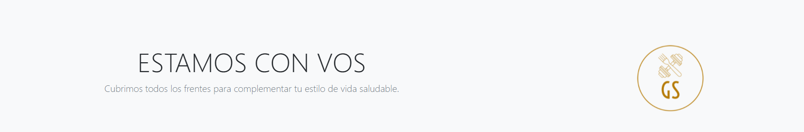

<h1 align="center">Gold Standard Nutrition</h1>

<h2 align="center"> Proyecto Final - Coder Diseño Web Comisión 22220 - David Victoria </h2>

<!-- SOBRE -->
## Acerca del proyecto

<!-- DESCRIPCION -->
Gold Standard Nutrition o **GS Nutrition** es una empresa ficticia que ofrece productos y servicios relacionados a la salud, deporte y recuperación física tales como `suplementos`, `vitaminas`, `comidas y bebidas`, `ropa deportiva`, `pesas y equipamiento de gym`y `entrenamiento personalizado/grupal`.
También incluye un sistema de membresía con pago mensual para disfrutar ciertos beneficios premium, tales como son descriptos en "Descubrinos".

El estilo y diseño apuntan a transmitir pureza y limpieza a través de la estética simplista y minimalista. Esto es para relacionar el producto con lo natural y lo saludable. Busca contagiar también tranquilidad para una navegación óptima donde lo ofrecido en la página tiene más valor que el fondo y los colores.
La barra de navegación mantiene un color prácticamente transparente para una lectura fácil a la vista -- muy similar a la paleta principal. El color secundario es el dorado, por referencia a la palabra "gold" del título y apunta a las partes más importantes, tales como el logo (diseñado en Canva) o la suscripción premium.

<!-- PAGINAS -->

#### -Home: 
Incluye un carrusel con dos videos llamativos para darle movimiento al inicio de la navegación. Está el logo y el slogan. Hay links al shop, principal motivo de la existencia del sitio.

#### -Shop: 
En segundo lugar del navbar ya que, como antes mencioné, es un sitio primordialmente de e-commerce.

#### -Training: 
Cuatro categorías principales para que los clientes conozcan brevemente los servicios ofrecidos, y opten por registrarse para saber más.

#### -Descubrinos: 
Página donde se describen los valores principales de la compañía y se muestran los planes de membresía disponibles.

#### -Miembros/Iniciar Sesión y Registro: 
Los usuarios pueden loguearse a su cuenta o bien crear una nueva.

<!-- Herramientas -->

### Herramientas / Plugins Utilizados

* Visual Studio
* HTML
* CSS/SASS
* Bootstrap
* MDB
* Google Fonts
* GitBash / GitHub
* Canva
* Adobe Photoshop
* Google Chrome (testeo de responsive)

<!-- CONTACTO -->
## Contacto

[David Victoria](https://twitter.com/FlorealV) - df.victoria@outlook.com

Proyecto: https://dfvictoria.github.io/GS-Nutrition/

<!-- AGRADECIMIENTOS -->
## Muchísimas gracias a:

* Profesor Rodrigo Zungri, por las clases dinámicas, informativas y claras. Este es mi primer curso en Coder y me llevo una excelente impresión.
* Tutor Joaquín Gonzalez, por las respuestas a mis interminables preguntas específicas por Slack y ser tan atento para ayudar. Un genio.
